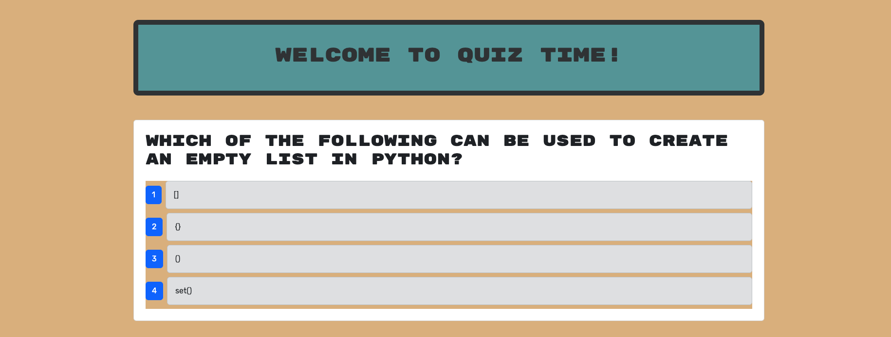

[](https://opensource.org/licenses/MIT)

# Quiz Time

## Description

This is a website where a user can test their knowledge of Python!

## Table of Contents

- [Installation](#installation)
- [Usage](#usage)
- [Credits](#credits)
- [License](#license)
- [Contributing](#contributing)
- [Tests](#tests)
- [Questions](#questions)

## Installation

To use the project, follow this [link](https://quiz-time-2ps0.onrender.com/). The website is deployed on a free [Render](https://render.com/) server and may take over a minute to load since free Render deployments sleep when not in use.

## Usage

Once at the webpage, you'll see this page.


Click on the "Start Quiz" button to get going! You'll be asked a series of 10 multiple choice questions that look like this.



Select the button (labelled as 1-4) next to the answer that you believe responds correctly to the question. You'll do this for all 10 questions. Once you've completed the quiz, you'll see this page, which will present your score and give you the option to take the quiz again.


That's pretty much it. As always, feel free to play around with the site and make sure to report any bugs!

## Credits

- The starter files for this project were supplied by edX Boot Camps LLC

## License

Licensed under the [MIT](./LICENSE) license.

## Contributing

This project has no contribution guidelines.

## Tests

There are tests developed for this project using [Cypress](https://docs.cypress.io/app/get-started/why-cypress). To run the tests, install and run the project as outlined above in [Installation](#installation). Once the application is running, open a new terminal and navigate to the root directory of the project. Run ```npm run test``` and the tests will run. The results should be diplayed in the terminal window.

The components tests will also always run automatically when a pull request is made to the ```develop``` or ```main``` branches thanks to GitHub actions.

## Questions

- GitHub: [Johngoldade](https://github.com/Johngoldade)
- Email: [goldade.john@gmail.com](mailto:goldade.john@gmail.com)

To ask further questions, reach out to me at the above email and I will get back to you as soon as I can.